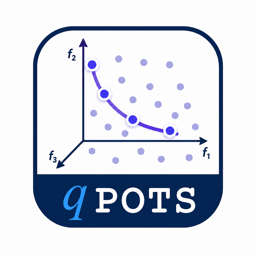

<p align="center">
  
</p>

<p align="center">
  <strong>Batch Pareto Optimal Thompson Sampling for multiobjective Bayesian optimization</strong>
</p>

<p align="center">
  <a href="https://proceedings.mlr.press/v258/renganathan25a.html"></a>
  <a href="https://pypi.org/project/qpots/"></a>
  <a href="https://qpots-batch-pareto-optimal-thompson-sampling.readthedocs.io/en/latest/"></a>
  <a href="LICENSE"></a>
  
</p>

$q\texttt{POTS}$ is a Python package for sample-efficient multiobjective Bayesian optimization. It implements **Pareto Optimal Thompson Sampling**, a batch acquisition strategy that selects candidates according to their probability of being Pareto optimal under Gaussian-process posterior samples.

The project is maintained by the Computational Complex Engineered Systems Design Laboratory ([CSDL](https://sites.psu.edu/csdl/)) at Penn State.

## Why $q\texttt{POTS}$?

Multiobjective optimization often requires many expensive function evaluations before a useful Pareto front emerges. $q\texttt{POTS}$ combines Gaussian-process surrogate modeling with evolutionary optimization over posterior samples, giving users a practical way to propose informative batches without directly optimizing a difficult analytical acquisition function.

Use $q\texttt{POTS}$ when you need to:

- optimize two or more competing objectives with limited evaluation budget;
- propose one or more candidates per Bayesian optimization iteration;
- handle BoTorch benchmark functions or your own custom objectives;
- compare $q\texttt{POTS}$ against common multiobjective acquisition strategies; or
- run TS-EMO baselines when MATLAB Engine is available.

## Installation

Install the latest release from PyPI:

```bash
pip install qpots
```

To install from source:

```bash
git clone https://github.com/csdlpsu/qpots
cd qpots
pip install .
```

$q\texttt{POTS}$ supports Python 3.10 and 3.11. The core $q\texttt{POTS}$ implementation uses Python dependencies installed by `pip`, including BoTorch, PyTorch, GPyTorch, NumPy, SciPy, scikit-learn, and pymoo.

### Optional MATLAB Engine

The MATLAB Engine is only needed if you plan to use the TS-EMO baseline included with this repository. $q\texttt{POTS}$ itself and the BoTorch-based acquisition functions do not require MATLAB.

Install MATLAB Engine with the version that matches your local MATLAB installation. For example, MATLAB R2023b uses:

```bash
pip install matlabengine==23.2.1
```

See MathWorks' [MATLAB Engine for Python installation guide](https://www.mathworks.com/help/matlab/matlab_external/install-the-matlab-engine-for-python.html) for release-specific instructions.

## Quick Start

The example below runs $q\texttt{POTS}$ on the two-objective Branin-Currin benchmark.

```python
import time
import warnings

import torch
from botorch.utils.transforms import unnormalize

from qpots.acquisition import Acquisition
from qpots.config import DEFAULT_DEVICE, DEFAULT_DTYPE
from qpots.function import Function
from qpots.model_object import ModelObject
from qpots.utils.utils import expected_hypervolume

warnings.filterwarnings("ignore")

settings = {
    "ntrain": 20,
    "iters": 50,
    "reps": 20,
    "q": 1,
    "wd": ".",
    "ref_point": torch.tensor([-300.0, -18.0], device=DEFAULT_DEVICE, dtype=DEFAULT_DTYPE),
    "dim": 2,
    "nobj": 2,
    "ncons": 0,
    "nystrom": 0,
    "nychoice": "pareto",
    "ngen": 10,
}

test_function = Function("branincurrin", dim=settings["dim"], nobj=settings["nobj"])
evaluate = test_function.evaluate
bounds = test_function.get_bounds()

torch.manual_seed(1023)

train_x = torch.rand(
    settings["ntrain"],
    settings["dim"],
    device=DEFAULT_DEVICE,
    dtype=DEFAULT_DTYPE,
)
train_y = evaluate(unnormalize(train_x, bounds))

model = ModelObject(
    train_x=train_x,
    train_y=train_y,
    bounds=bounds,
    nobj=settings["nobj"],
    ncons=settings["ncons"],
)
model.fit_gp()

acquisition = Acquisition(test_function, model, q=settings["q"])

for iteration in range(settings["iters"]):
    start = time.time()
    new_x = acquisition.qpots(bounds=bounds, iteration=iteration, **settings)
    elapsed = time.time() - start

    new_y = evaluate(unnormalize(new_x.reshape(-1, settings["dim"]), bounds))
    hypervolume, _ = expected_hypervolume(model, ref_point=settings["ref_point"])

    print(
        f"Iteration: {iteration}, "
        f"New candidate: {new_x}, "
        f"Time: {elapsed:.3f}s, "
        f"HV: {hypervolume}"
    )

    train_x = torch.row_stack([train_x, new_x.view(-1, settings["dim"])])
    train_y = torch.row_stack([train_y, new_y])

    model = ModelObject(
        train_x=train_x,
        train_y=train_y,
        bounds=bounds,
        nobj=settings["nobj"],
        ncons=settings["ncons"],
    )
    model.fit_gp()
    acquisition = Acquisition(test_function, model, q=settings["q"])
```

## Runtime Precision And Device

$q\texttt{POTS}$ keeps precision and device selection in one easy-to-find place: [`qpots/config.py`](qpots/config.py). By default, the package uses CUDA when PyTorch detects a GPU and otherwise falls back to CPU:

```python
DEFAULT_DTYPE = torch.float64
DEFAULT_DEVICE = torch.device("cuda" if torch.cuda.is_available() else "cpu")
```

Change `DEFAULT_DTYPE` to `torch.float32` for lower-memory single precision, or keep `torch.float64` for the default double-precision behavior used by BoTorch. Core package tensors created by $q\texttt{POTS}$ inherit these settings unless you pass an explicit `device` or `dtype`.

For complete scripts, see:

- [Unconstrained Branin](examples/unconstrained_branin.py)
- [Constrained optimization](examples/constrained_example.py)
- [Custom objective functions](examples/custom_function_example.py)
- [Multiple acquisition functions](examples/multiple_acquisitions_example.py)
- [HPC-style runs](examples/hpc_example.py)

## Documentation

The hosted documentation includes installation notes, API references, and worked examples:

[qpots-batch-pareto-optimal-thompson-sampling.readthedocs.io](https://qpots-batch-pareto-optimal-thompson-sampling.readthedocs.io/en/latest/)

## Main Reference

The main reference for this repository is the AISTATS 2025 paper:

> Ashwin Renganathan and Kade Carlson. $q\texttt{POTS}$: Efficient Batch Multiobjective Bayesian Optimization via Pareto Optimal Thompson Sampling. Proceedings of The 28th International Conference on Artificial Intelligence and Statistics, PMLR 258:4051-4059, 2025.

```bibtex
@inproceedings{renganathan2025qpots,
  title={qPOTS: Efficient Batch Multiobjective Bayesian Optimization via Pareto Optimal Thompson Sampling},
  author={Renganathan, Ashwin and Carlson, Kade},
  booktitle={International Conference on Artificial Intelligence and Statistics},
  pages={4051--4059},
  year={2025},
  organization={PMLR}
}
```

Additional links:

- [AISTATS/PMLR paper page](https://proceedings.mlr.press/v258/renganathan25a.html)
- [PDF](https://raw.githubusercontent.com/mlresearch/v258/main/assets/renganathan25a/renganathan25a.pdf)
- [arXiv preprint](https://arxiv.org/abs/2310.15788)

## Development

Clone the repository and install the package in editable mode with the test dependencies:

```bash
git clone https://github.com/csdlpsu/qpots
cd qpots
pip install -e .
pip install -r tests/requirements.txt
```

Run the test suite with:

```bash
pytest
```

The package source lives in [`qpots/`](qpots/), examples live in [`examples/`](examples/), tests live in [`tests/`](tests/), and Sphinx documentation lives in [`docs/`](docs/).

## License

This project is distributed under the terms of the [GNU General Public License v3.0](LICENSE).
