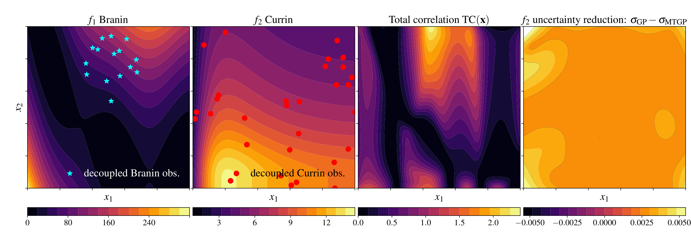

qPOTS-Decoupled
===============

.. important::

   Earlier project material called this mode **qPOTS-DOE**, where DOE meant
   **decoupled oracle evaluations**. The preferred name is now
   **qPOTS-Decoupled** to avoid confusion with design of experiments.

What is an oracle?
------------------

An oracle is one measurable model output: an objective or a constraint. In a
coupled evaluation, every oracle is evaluated whenever a design is selected.
In a decoupled evaluation, individual oracles can be queried separately.

Examples include aerodynamic coefficients requiring different solver runs,
material properties measured by different laboratory procedures, or
constraints evaluated by analyses separate from the objective simulation.
Decoupling can reduce total evaluation cost when not every output is needed at
every selected design.

.. list-table::
   :header-rows: 1
   :widths: 24 38 38

   * - Mode
     - Observation pattern
     - qPOTS configuration
   * - Standard coupled qPOTS
     - All outputs at every design, modeled independently
     - ``multitask=False``, ``partial_evaluations=False``
   * - Coupled multitask qPOTS
     - All outputs at every design, modeled jointly
     - ``multitask=True``, ``partial_evaluations=False``
   * - qPOTS-Decoupled
     - A selected subset of outputs at each design
     - ``multitask=True``, ``partial_evaluations=True``

How task selection works
------------------------

qPOTS-Decoupled adds an output-selection step after qPOTS proposes candidate
locations:

1. A multitask Gaussian process is fit jointly across objective and constraint
   outputs. Missing observations are omitted from model fitting.
2. qPOTS draws a posterior sample path and selects a diverse candidate batch.
3. At each candidate, the posterior covariance between output tasks is
   converted to a total-correlation score.
4. If the absolute score is greater than ``correlation_threshold``, a Gaussian
   mutual-information criterion chooses an informative output subset.
5. Otherwise, all outputs are selected at that candidate.
6. Selected values are appended to the training data; unselected entries are
   represented by ``NaN`` and ignored by the next multitask fit.

The figure illustrates task-specific observations for Branin and Currin, the
posterior total-correlation field used for gating, and uncertainty reduction
from information sharing between tasks.

Configure qPOTS-Decoupled
-------------------------

The constrained OSY benchmark has two objectives followed by six constraints:

.. code-block:: python

   from qpots import Function, QPOTSConfig, QPOTSRunner

   problem = Function("osy", dim=6, nobj=2)
   config = QPOTSConfig(
       n_initial=60,
       iterations=50,
       batch_size=2,
       n_constraints=6,
       generations=20,
       multitask=True,
       partial_evaluations=True,
       correlation_threshold=1e-4,
       seed=1023,
   )

   result = QPOTSRunner(problem, config).run()

``partial_evaluations=True`` requires ``multitask=True``. The initial designs
are fully observed so the multitask model has data for every output before it
begins selecting subsets.

Output and task ordering
------------------------

Output columns and task indices always use this order:

1. objective tasks ``0`` through ``nobj - 1``;
2. constraint tasks ``nobj`` through ``nobj + n_constraints - 1``.

Each :class:`qpots.runner.IterationResult` contains:

``candidate_x``
   Candidate designs in physical coordinates.

``task_ids``
   A matrix with one row per candidate and one column per possible output. A
   numeric entry is the selected task index; ``NaN`` means that output was not
   selected.

``observed_values``
   Objective and constraint values retained for model training. Unqueried
   entries are ``NaN``.

``evaluations``
   The complete :class:`qpots.function.EvaluationResult` returned by the
   benchmark function.

Count scalar oracle evaluations with:

.. code-block:: python

   import torch

   queried = sum(
       int((~torch.isnan(step.observed_values)).sum())
       for step in result.iterations
   )
   coupled = config.iterations * config.batch_size * (problem.nobj + config.n_constraints)
   print(f"Selected {queried} of {coupled} possible infill oracle evaluations")

Choose a threshold
------------------

A numeric ``correlation_threshold`` enables the total-correlation gate. A
smaller positive threshold generally makes subset selection more frequent; a
larger threshold requires stronger posterior dependence before outputs are
decoupled. The useful scale is problem-dependent, so compare oracle counts and
optimization quality across several thresholds.

``correlation_threshold=None`` uses random task subsets and is mainly useful as
a diagnostic or experimental baseline. It does not apply the
total-correlation gate.

.. _benchmarking-versus-real-oracle-calls:

Benchmarking versus real oracle calls
-------------------------------------

The bundled benchmark runner computes the complete output vector so that
ground-truth performance can be assessed, then exposes only the selected
entries to model training. This emulates partial observations but does not save
computation for an in-process benchmark function.

For a real experiment or external simulator, obtain candidate locations and
``task_ids`` from the lower-level :meth:`qpots.acquisition.Acquisition.qpots`
interface before invoking the expensive oracles. Query only those task IDs,
store skipped outputs as ``NaN``, and refit the multitask model. The
:doc:`decoupled_osy_example` demonstrates the data representation and task
accounting used by this workflow.

Assumptions and limitations
---------------------------

* Outputs must share the same design-variable space.
* Useful decoupling depends on learnable cross-task correlation.
* Every output needs enough initial or accumulated data to fit the multitask
  model reliably.
* Hypervolume is computed from objective columns only and must filter
  infeasible designs using the constraint columns.
* qPOTS considers constraints feasible when their values are nonnegative.
